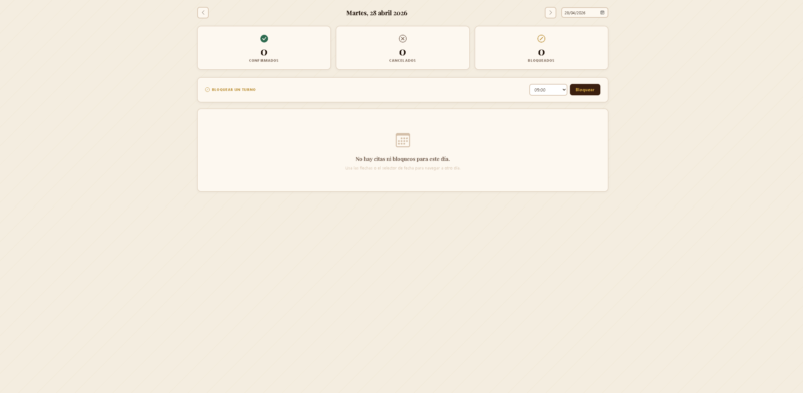
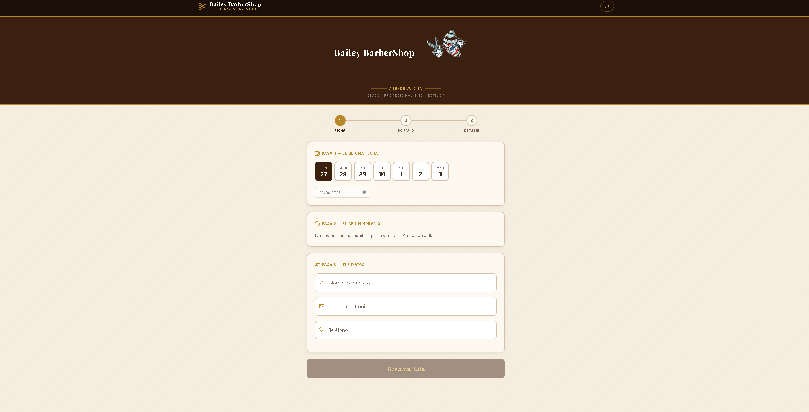

# Barber Booking System

A full-stack web application for managing barbershop appointments, built with FastAPI and deployed on AWS. Designed with a focus on clean architecture, cost efficiency, and real-world DevOps practices.

---

## Problem It Solves

Traditional appointment booking in small businesses is often manual, inefficient, and prone to scheduling conflicts.

This system provides a simple and reliable way to:

* Schedule appointments online
* Avoid double bookings
* Manage reservations through an admin dashboard

---

## Features

### Customer

* Book appointments in available time slots
* Real-time availability validation
* Conflict prevention

### Admin Dashboard

* Secure login (JWT-based authentication)
* View, create, update, and delete appointments
* Email notifications sent on booking and cancellation
* Centralized reservation management

---

## Screenshots

| Login | Dashboard | Booking |
|-------|-----------|---------|
|  |  |  |

---

## Tech Stack

* **Backend:** FastAPI
* **Frontend:** HTML, CSS, JavaScript
* **Database:** PostgreSQL (Supabase)
* **Server:** AWS EC2
* **Web Server:** Nginx
* **Process Management:** systemd
* **ORM & Migrations:** SQLAlchemy + Alembic

---

## Getting Started

### Prerequisites

* Python 3.11+
* Git

### Installation

```bash
git clone https://github.com/noobpingui/barber-booking-system.git
cd barber-booking-system
```

**Set up the environment:**

```bash
cp .env.example .env
```

Open `.env` and fill in the required values:
```bash
| Variable | Description |
|----------|-------------|
| `DATABASE_URL` | SQLite path (dev, no setup needed) or PostgreSQL connection string |
| `SECRET_KEY` | Random secret for JWT signing — generate with: `python -c "import secrets; print(secrets.token_hex(32))"` |
| `EMAIL_PROVIDER` | `resend` (default) or `ses` |
| `RESEND_API_KEY` | Required when `EMAIL_PROVIDER=resend` |
```

**Install dependencies:**

```bash
pip install -e ".[dev]"
```

**Run database migrations:**

```bash
alembic upgrade head
```

> In development, tables are also created automatically on startup when using SQLite.

**Start the server:**

```bash
uvicorn app.main:app --reload
```

The app will be available at `http://localhost:8000`.

> Set `DEBUG=true` in `.env` to enable interactive API docs at `http://localhost:8000/docs`.

---

## Architecture

### Before

```text
Client → Nginx → FastAPI (EC2) → PostgreSQL (local)
```

### After (Optimized)

```text
Client → Nginx → FastAPI (EC2 t3.nano) → Supabase (Managed PostgreSQL)
```

---

## DevOps & Infrastructure

* Migrated database from local PostgreSQL to **Supabase** using `pg_dump`
* Reduced infrastructure cost by switching from **t3.micro → t3.nano**
* Removed local database to free memory and simplify architecture
* Configured **Uvicorn with 1 worker** (optimized for low-memory environments)
* Added **1GB swap memory** to improve system stability under memory pressure
* Deployed app as a **systemd service** (auto-restart on failure)

---

## Deployment

* Hosted on AWS EC2
* Reverse proxy with Nginx
* FastAPI served via Uvicorn
* Domain + HTTPS configured

---

## Key Design Decisions

* **Externalized database (Supabase):** improves scalability and reduces server load
* **Single worker setup:** efficient for async workloads in low-resource environments
* **Swap memory usage:** prevents crashes in constrained instances
* **Layered architecture:** separation of concerns for maintainability

---

## Summary

This project demonstrates:

* Full-stack development with FastAPI
* Real-world deployment on AWS
* Database migration and architecture evolution
* Cost optimization and resource management
* Practical DevOps decision-making

---
